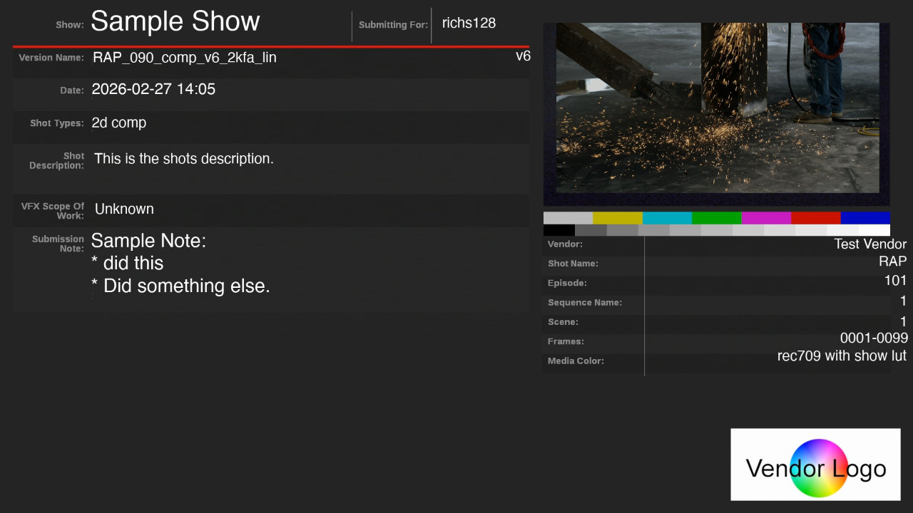
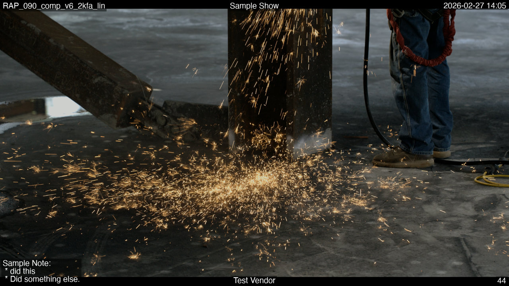

# FFmpeg OCIO Filter

<details open markdown="block">
  <summary>
    Table of contents
  </summary>
  {: .text-delta }
1. TOC
{:toc}
</details>

With the introduction of FFmpeg 8.1 a [OCIO](https://ocio.readthedocs.io/en/latest/) [filter](https://ffmpeg.org/ffmpeg-filters.html#ocio) has been added. This allows you to convert from EXR files directly to encoded media using an OCIO filter to convert the colorspace correctly without needing an intermediate file.

If you are encoding to YCbCr, you should perform the OCIO conversion in an RGB colorspace first, and then convert to YCbCr using the `scale` filter. FFmpeg's `scale` filter automatically handles the conversion from RGB formats (like `rgb48`) to YCbCr variants (like `yuv420p10le`), ensuring correct chroma subsampling and range mapping.

## Example Usage

### Using OCIO-Display

This example is encoding to a 10-bit h264 quicktime.

```console
ffmpeg -y  -framerate 24 -start_number <STARTFRAME> -i SOURCEFRAMES.%05d.exr \
   -c:v h264 -pix_fmt yuv420p10le -crf 18 -preset slow \
   -vf "ocio=input=ACEScct:display=sRGB - Display:view=ACES 1.0 - SDR Video:format=rgb48,scale=in_color_matrix=bt709:out_color_matrix=bt709,format=yuv444p10"   OUTPUTFILE.mov
```

### Using an output colorspace (in this case ACEScct)

This is using the older style colorspace conversion where you are specifying an output colorspace (in this case ACEScct).

```console
ffmpeg -y  -framerate 24 -start_number <STARTFRAME> -i SOURCEFRAMES.%05d.exr \
   -c:v h264 -pix_fmt yuv420p10le -crf 18 -preset slow \
    -vf "ocio=input=ACEScg:output=ACEScct:format=rgb48,scale=in_color_matrix=bt709:out_color_matrix=bt709,format=yuv444p10"   OUTPUTFILE.mov
```

The format parameter that's part of the OCIO filter allows you to specify an output pixel_format that OCIO will be converting to. This has to be an RGB colorspace since OCIO doesn't know how to convert to YCbCr. If you do not supply the format, the output will match the input with the exception of half-floats which will be converted to full floats (due to poor support for half-floats).

Note, you can also specify the OCIO config file as a "config" parameter; otherwise, it will default to the `OCIO` environment variable.

## Creating an HDR movie from ACEScg

This example demonstrates how to convert an ACEScg EXR image sequence to a 10-bit HDR10 (PQ) QuickTime movie.

This is converting from a ACEScg image sequence to a HDR PQ quicktime.

```console
ffmpeg -y -framerate 24 -start_number <STARTFRAME> -i SOURCEFRAMES.%04d.exr -c:v libx265 -pix_fmt yuv422p10le -threads 0 -vf "ocio=input=ACEScg:display=Rec.2100-PQ - Display:view=ACES 1.1 - HDR Video (1000 nits & Rec.2020 lim):format=rgb48,scale=in_range=full:in_color_matrix=bt2020:out_range=tv:out_color_matrix=bt2020" -color_range tv -color_trc smpte2084 -color_primaries bt2020 -colorspace bt2020nc -tag:v hvc1  \
    -x265-params "hdr-opt=1:colorprim=bt2020:transfer=smpte2084:colormatrix=bt2020nc:range=limited:master-display=G(13250,34500)B(7500,3000)R(34000,16000)WP(15635,16450)L(10000000,1):max-cll=1000,400" OUTPUTFILE.mov
```

## Converting an HDR movie back to ACEScg EXRs

To demonstrate converting from an HDR movie back to ACEScg, we first create a high-quality (lossless 12-bit 4:4:4) HDR movie:

To test converting from an HDR movie, we are going to create an HDR movie first:

```console
ffmpeg -y -framerate 24 -start_number 6100 -i <INPUTFILE>.%05d.exr -c:v libx265 -pix_fmt yuv444p12le -vf "ocio=input=ACEScg:display=Rec.2100-PQ - Display:view=ACES 1.1 - HDR Video (1000 nits & Rec.2020 lim):format=rgb48,scale=in_range=full:in_color_matrix=bt2020:out_range=tv:out_color_matrix=bt2020" -color_range tv -color_trc smpte2084 -color_primaries bt2020 -colorspace bt2020nc -tag:v hvc1      -x265-params "lossless=1:hdr-opt=1:colorprim=bt2020:transfer=smpte2084:colormatrix=bt2020nc:range=limited:master-display=G(13250,34500)B(7500,3000)R(34000,16000)WP(15635,16450)L(10000000,1):max-cll=1000,400" sparks_lossless_h265.mov
```

Note this is both 12-bit 444 and lossless, to make the comparison a little easier to rule out any encoding artifacts.

Then we can convert it back to EXR's:

```console
ffmpeg -y -i sparks_lossless_h265.mov -threads 0 -vf "ocio=input=ACEScg:display=Rec.2100-PQ - Display:view=ACES 1.1 - HDR Video (1000 nits & Rec.2020 lim):inverse=1:format=gbrpf32le,scale=out_range=full:out_color_matrix=bt2020"  testoutput/testoutput.%04d.exr
```

So while this will limit the max luminance to 1000 nits, it will give you a wide gamut with an higher dynamic range that you can convert back into a linear range which will be hugely superior to rec709 or Display P3. Obviously this is not as good as using the original EXR files, but it is certainly an improvement over rec709, giving you the ability to change the exposure

If your viewer supported HDR, this shows that you could internally convert it to ACEScg, so that any test color correction you might be doing in the viewer would be fairly representative of what it would be like if you were reading from an openEXR frame. Obviously the best results would be to use the EXR frames, but its certainly an improvement over rec709.

## Converting from HDR (Rec.2100) image sequence to ACEScg

If you have an image sequence that is already in an HDR space (like Rec.2100 PQ) and want to convert it to ACEScg EXRs, you can use the `inverse=1` parameter with the appropriate display and view:

```console
ffmpeg -y -i INPUT_REC2100.%04d.exr -vf "ocio=input=ACEScg:display=Rec.2100-PQ - Display:view=ACES 1.1 - HDR Video (1000 nits & Rec.2020 lim):inverse=1:format=gbrpf32le" testoutput_acescg.%04d.exr
```

## Filter Arguments

| Option | Description |
| ------ | ----------- |
| config | By default the filter will use the OCIO config defined by the OCIO environment variable, but this parameter allows you to explicitly specify its location. If you are getting started, you can use config=ocio://studio-config-v1.0.0_aces-v1.3_ocio-v2.1 which specifies one of the built in defaults. |
| input | Set the input colorspace. |
| output | Set the output colorspace. |
| display | Set the display colorspace, used in combination with view. |
| view | Set the view colorspace, used in combination with display. |
| inverse | When used in combination with display and view, this inverts the transform, so going from a display/view to the "input colorspace". |
| format | Allow you to specify the output pix_fmt of the OCIO filter. This *has* to be a RGB colorspace, so you really are limited to rgb24, rgba, rgb48, rgba48, gbrp10, gbrp12, gbrpf32le, gbrapf32le, for most encoding we would recommend rgb48. By default this is the pix_fmt of the input with the exception of gbrpf16le which we automatically convert to a 32bit version (half float is not fully supported by ffmpeg, swscale in particular). |
| context_params | Allow you to specify additional context parameters for the OCIO filter. This is a list of key=value pairs, separated by colons. |

## Building ffmpeg with OCIO support

If you are already manually building ffmpeg, you can enable OCIO support by adding the following flag to the configure script:

```console
--enable-libopencolorio
```

This does require opencolorio to be installed on the system, and be found by pkg-config.

If not, you may want to refer to the docker container build files in the [docker](docker) directory. In particular the [rocky-ffmpeg-8.1](docker/rocky-ffmpeg-8.1) directory. There is also a conan recipe in the [conan](conan/README.md) directory that can be used to build ffmpeg with OCIO support on macOS, linux and windows.

We do also want to flag a patch that didnt make it into the ffmpeg 8.1 release - <https://code.ffmpeg.org/FFmpeg/FFmpeg/pulls/21799>. This patch fixes an issue where the ocio filter was not able to output half-float formats and also can crash filters like zscale. Hopefully this will make it into the following release. The above build recipes do include this patch.

## Timing Tests

For some simple timing tests, we are comparing oiiotool using --parallel-frames (meaning the initial conversion is run in as many threads as possible) and ffmpeg (both single threaded and with 4 threads). This is a 4 second 4k exr image sequence of 200 frames (sparks) and we are encoding to prores_videotoolbox 422 HQ on a M2 Macbook Pro. We picked this particular codec since its fast, and works at high bit-depths (10 and 12-bit).

| Task | Elapsed time Seconds | Notes |
| :--- | ---: | :--- |
| oiiotool | 101.46 | Media conversion to PNG serially. |
| oiiotool with parallel-frames | 44.91 | Media conversion to PNG with --parallel-frames |
| basic ffmpeg | 2.87 | Just converting the resulting frames from PNG to a quicktime |
| oiiotool + ffmpeg | 47.78 | Combining parallel-frames and the ffmpeg generation |
| ffmpeg with 0 threads | 19.58 | This is the default option |
| ffmpeg with 1 threads | 127.75 | Single threaded. |
| ffmpeg with 2 threads | 65.90 | |
| ffmpeg with 4 threads | 33.95 | |
| ffmpeg with 6 threads | 23.74 | |
| ffmpeg with 8 threads | 37.75 | |

We recommend leaving it with the default of 0 threads (i.e. dont specify anything). It is worth noting that OCIO using the CPU is not super fast (although clearly faster than the alternative), we will explore using vulkan to accelerate this in the future.

## Slate and burn-in generation

By adding OCIO to FFmpeg, we can generate slates and burn-ins in the correct colorspace without needing to create an intermediate file. This is critical for VFX pipelines where metadata must be overlaid on color-corrected plates.

For an extreme example of building a slate and burn-in, see the following example, which is generated using the prototype dailies tool [ffmpeg-dailies](https://github.com/richardssam/ffmpeg-dailies).

| Example slate | Example burn-ins |
| :---: | :---: |
|  |  |

this is storing the filter in a separate file, to make it more stable.

```console
/Users/sam/roots/ffmpeg-ocio-8.1/bin/ffmpeg -y \
    -framerate 24 -start_number 1001 \
    -i tests/data/complex_paths/shots/SH010/v001/SH010_v001.%04d.exr \
    -i vfx-templates-blank-slate-0.0.6.jpg \
    -/filter_complex filterfile.txt \
    -map "[final_v]" \
    -c:v libx264 -crf 18 -preset slow -pix_fmt yuv420p10le \
    -r 24 \
    -metadata comment="Sample Note:
 * did this
 * Did something else." \
    -metadata artist="Test Vendor" \
    -metadata shot_types="2d comp" \
    -metadata submit_for="richs128" \
    -metadata scope_of_work="Unknown" \
    -metadata shot_description="This is the shots description." \
    -metadata episode="101" \
    -metadata sequence_name="1" \
    -metadata scene="1" \
    -metadata media_color="rec709 with show lut" \
    -metadata title="Sample Show" \
    -metadata date="2026-02-27 14:05" \
    -metadata original_filename="SH010_v001" \
    -metadata shot="SH010" \
    -metadata version="v001" \
    -metadata frame_range="1001-1024" \
    -metadata source_filename="/Users/sam/git/ffmpeg-dailies/tests/data/complex_paths/shots/SH010/v001/SH010_v001.#.exr" \
    -metadata first_frame="1001" \
    -metadata last_frame="1024" \
    -metadata source_frame_rate="24" \
    -metadata slate_length="1" \
    -metadata display_type="sRGB - Display (ACES 1.0 - SDR Video)" \
    -metadata watermarking="True" \
    -metadata:s:v:0 reel_name="SH010_v001" \
    -timecode 00:00:41:16 \
    -movflags use_metadata_tags \
    -color_primaries bt709 \
    -color_trc iec61966-2-1 \
    -colorspace bt709 \
    test_output.mov
```

The filterfile.txt is as follows:

[!IMPORTANT]
FFmpeg's filtergraph script parser (`-filter_complex_script`) does not support `#` comments or line breaks inside a filter chain. The following example includes comments for documentation purposes; these **must** be removed in the actual file.

 ```
# Split source for thumbnail extraction
[0:v]split=2[main_v][thumb_stream];
# Prepare slate background
[1:v]scale=1920:1080,setsar=1,trim=end_frame=1[slate_bg];
# Extract and process thumbnail (frame 12)
[thumb_stream]select='eq(n\,12)', 
    scale=681:383:force_original_aspect_ratio=decrease, 
    ocio=config='../ffmpeg-ocio-test/sourcemedia/studio-config-v1.0.0_aces-v1.3_ocio-v2.1_ns.ocio': 
    input='ACEScg':display='sRGB - Display':view='ACES 1.0 - SDR Video', 
    scale=in_color_matrix=bt709:out_color_matrix=bt709, 
    trim=end_frame=1,setpts=PTS-STARTPTS[pip];

# Overlay thumbnail onto slate
[slate_bg][pip]overlay=x=1170:y=48[slate_with_pip];

# Slate color space conversion
[slate_with_pip]scale=in_color_matrix=bt709:out_color_matrix=bt709[slate_vf];

# Draw metadata on slate
[slate_vf]drawtext=text='Sample Show':x=190:y=21:fontcolor=white:fontsize=58:fontfile='/System/Library/Fonts/Helvetica.ttc', 
    drawtext=text='Test Vendor':x=(1363+545-tw):y=502:fontcolor=white:fontsize=29:fontfile='/System/Library/Fonts/Helvetica.ttc', 
    drawtext=text='2026-02-27 14\:05':x=193:y=175:fontcolor=white:fontsize=33:fontfile='/System/Library/Fonts/Helvetica.ttc', 
    drawtext=text='Sample Note\:':x=191:y=490:fontcolor=white:fontsize=40:fontfile='/System/Library/Fonts/Helvetica.ttc', 
    drawtext=text=' * did this':x=191:y=538:fontcolor=white:fontsize=40:fontfile='/System/Library/Fonts/Helvetica.ttc', 
    drawtext=text=' * Did something else.':x=191:y=586:fontcolor=white:fontsize=40:fontfile='/System/Library/Fonts/Helvetica.ttc', 
    drawtext=text='SH010_v001':x=195:y=109:fontcolor=white:fontsize=30:fontfile='/System/Library/Fonts/Helvetica.ttc', 
    drawtext=text='v001':x=(780+337-tw):y=106:fontcolor=white:fontsize=30:fontfile='/System/Library/Fonts/Helvetica.ttc', 
    drawtext=text='1001-1024':x=(1364+547-tw):y=700:fontcolor=white:fontsize=30:fontfile='/System/Library/Fonts/Helvetica.ttc', 
    drawtext=text='SH010':x=(1365+543-tw):y=539:fontcolor=white:fontsize=29:fontfile='/System/Library/Fonts/Helvetica.ttc', 
    drawtext=text='2d comp':x=196:y=253:fontcolor=white:fontsize=30:fontfile='/System/Library/Fonts/Helvetica.ttc', 
    drawtext=text='101':x=(1364+546-tw):y=579:fontcolor=white:fontsize=30:fontfile='/System/Library/Fonts/Helvetica.ttc', 
    drawtext=text='1':x=(1363+546-tw):y=622:fontcolor=white:fontsize=30:fontfile='/System/Library/Fonts/Helvetica.ttc', 
    drawtext=text='1':x=(1362+547-tw):y=666:fontcolor=white:fontsize=30:fontfile='/System/Library/Fonts/Helvetica.ttc', 
    drawtext=text='rec709 with show lut':x=(1331+576-tw):y=737:fontcolor=white:fontsize=30:fontfile='/System/Library/Fonts/Helvetica.ttc', 
    drawtext=text='richs128':x=930:y=36:fontcolor=white:fontsize=30:fontfile='/System/Library/Fonts/Helvetica.ttc', 
    drawtext=text='Unknown':x=199:y=428:fontcolor=white:fontsize=30:fontfile='/System/Library/Fonts/Helvetica.ttc', 
    drawtext=text='This is the shots description.':x=195:y=312:fontcolor=white:fontsize=30:fontfile='/System/Library/Fonts/Helvetica.ttc'[slate_out];

# Main video scaling and padding
[main_v]scale=1920:1080:force_original_aspect_ratio=decrease,pad=1920:1080:(ow-iw)/2:(oh-ih)/2,setsar=1[v_step_0];

# Main video OCIO color management
[v_step_0]ocio=config='../ffmpeg-ocio-test/sourcemedia/studio-config-v1.0.0_aces-v1.3_ocio-v2.1_ns.ocio': 
    input='ACEScg':display='sRGB - Display':view='ACES 1.0 - SDR Video'[v_step_1];

# Main video burn-ins
[v_step_1]drawtext=text='Sample Note':x=10:y=h-th-10:fontcolor=white:fontsize=30:fontfile='/System/Library/Fonts/Helvetica.ttc':box=1:boxcolor=black@0.5:boxborderw=5:start_number=1001, 
    drawtext=text='Test Vendor':x=(w-tw)/2:y=h-th-10:fontcolor=white:fontsize=30:fontfile='/System/Library/Fonts/Helvetica.ttc':box=1:boxcolor=black@0.5:boxborderw=5:start_number=1001, 
    drawtext=text='%{frame_num}':x=w-tw-10:y=h-th-10:fontcolor=white:fontsize=30:fontfile='/System/Library/Fonts/Helvetica.ttc':box=1:boxcolor=black@0.5:boxborderw=5:start_number=1001, 
    drawtext=text='SH010_v001':x=10:y=10:fontcolor=white:fontsize=30:fontfile='/System/Library/Fonts/Helvetica.ttc':box=1:boxcolor=black@0.5:boxborderw=5:start_number=1001, 
    drawtext=text='Sample Show':x=(w-tw)/2:y=10:fontcolor=white:fontsize=30:fontfile='/System/Library/Fonts/Helvetica.ttc':box=1:boxcolor=black@0.5:boxborderw=5:start_number=1001, 
    drawtext=text='2026-02-27 14\:05':x=w-tw-10:y=10:fontcolor=white:fontsize=30:fontfile='/System/Library/Fonts/Helvetica.ttc':box=1:boxcolor=black@0.5:boxborderw=5:start_number=1001[v_step_2];

# Final format pass
[v_step_2]scale=in_color_matrix=bt709:out_color_matrix=bt709[video_out];

# Join slate and video
[slate_out][video_out]concat=n=2:v=1:a=0[final_v]
```
